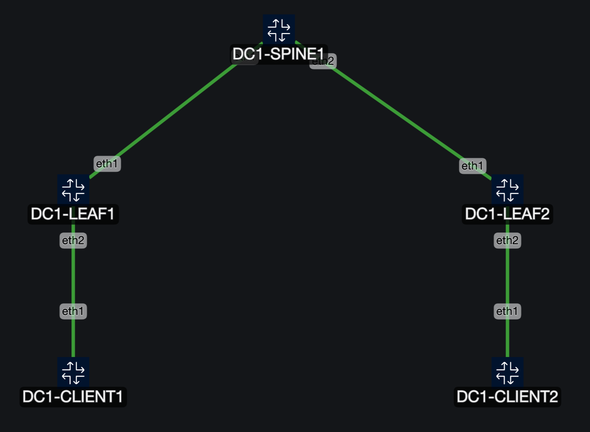
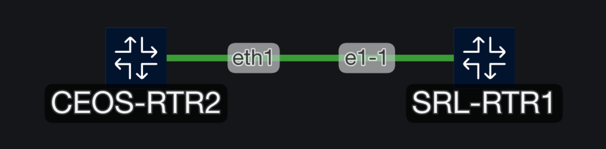

# Labs

- [Labs](#labs)
  - [Requirements](#requirements)
  - [Arista cEOS-Lab](#arista-ceos-lab)
    - [Installing Arista cEOS-Lab image](#installing-arista-ceos-lab-image)
  - [Multi-vendor Lab](#multi-vendor-lab)
    - [Installing Nokia SR Linux image](#installing-nokia-sr-linux-image)

## Requirements

Following basic tools are required for deploying the labs:

- [docker](https://docs.docker.com/get-started/get-docker/)
- [containerlab](https://containerlab.dev/install/)
- container images
  - [Arista cEOS-Lab image](https://www.arista.com/en/support/software-download)
  - [Nokia srlinux image](https://github.com/nokia/srlinux-container-image/releases)
- vscode

**NOTE**: For using containerlab and Arista cEOS-Lab on MAC OS (arm) use the [devcontainer](https://containerlab.dev/macos/#devcontainer) for containerlab and cEOS-Lab arm image from software downloads.

## Arista cEOS-Lab



### Installing Arista cEOS-Lab image

- Download the image from [www.arista.com](https://www.arista.com) > Software Downloads > cEOS-Lab > EOS-4.2x.y > cEOS-lab-4.2x.y.tar.xz
- Copy the cEOS-lab-4.2x.y.tar.xz to the host/server/VM.
- Next, use the tar file to import the cEOS-Lab image using the following command

```shell
docker import cEOS64-lab-4.26.1F.tar.xz ceosimage:4.26.1F
```

- Now you should be able to see the Arista cEOS-Lab image.

```shell
docker images | egrep "REPO|ceos"
```

Use the [topology.clab.yml](../labs/arista-ceos/topology.clab.yml) file to deploy the Arista cEOS-Lab using [containerlab](https://containerlab.dev/cmd/deploy/) `clab deploy` command or use the vscode containerlab extension.

## Multi-vendor Lab



### Installing Nokia SR Linux image

```shell
docker pull ghcr.io/nokia/srlinux:25.3.2
```

Use the [topology.clab.yml](../labs/multi-vendor/topology.clab.yml) file to deploy the lab using [containerlab](https://containerlab.dev/cmd/deploy/) `clab deploy` command or use the vscode containerlab extension.
